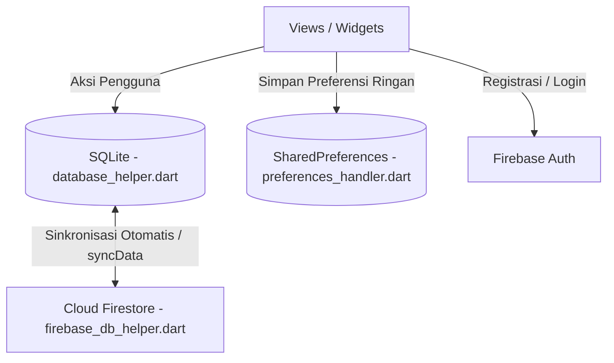

# Dokumentasi Arsitektur & Teknologi Aplikasi Skinoura

Dokumen ini menjelaskan struktur arsitektur, teknologi (dependencies), serta alur kerja data pada aplikasi **Skinoura** (CareSkin+).

---

## 🏗️ 1. Arsitektur Aplikasi

Aplikasi Skinoura dibangun menggunakan pola arsitektur modular yang memisahkan tanggung jawab (separation of concerns) ke dalam beberapa folder utama di dalam direktori `lib/`.

```
lib/
├── auth/            # Halaman dan alur autentikasi (Login, Registrasi)
├── database/        # Manajemen database lokal (SQLite), cloud (Firestore), & Shared Preferences
├── extension/       # Method extensions pembantu (helper) untuk tipe data bawaan
├── models/          # Model representasi data (Data Classes / Entities)
├── services/        # Service eksternal (Firebase Auth, Local Notifications)
├── views/           # Halaman UI utama aplikasi
├── widgets/         # Komponen UI modular yang dapat digunakan kembali (reusable)
├── main.dart        # Entry point aplikasi
└── firebase_options.dart # Konfigurasi Firebase untuk platform target
```

### Penjelasan Folder & Tanggung Jawab:

*   **`auth/`**: Mengelola halaman login ([form_login.dart](file:///D:/Project%20Flutter/Skinoura/skinoura/lib/auth/form_login.dart)) dan registrasi ([Form_Registrasi.dart](file:///D:/Project%20Flutter/Skinoura/skinoura/lib/auth/Form_Registrasi.dart)). Menjadi jembatan antara input pengguna dan layanan autentikasi Firebase.
*   **`database/`**:
    *   `database_helper.dart` ([DBHelper](file:///D:/Project%20Flutter/Skinoura/skinoura/lib/database/database_helper.dart)): Mengelola database SQLite lokal (`skinoura.db`) untuk performa offline yang cepat.
    *   `firebase_db_helper.dart` ([FirebaseDBHelper](file:///D:/Project%20Flutter/Skinoura/skinoura/lib/database/firebase_db_helper.dart)): Mengelola sinkronisasi data ke Cloud Firestore.
    *   `preferences_handler.dart` ([PreferencesHandler](file:///D:/Project%20Flutter/Skinoura/skinoura/lib/database/preferences_handler.dart)): Mengelola penyimpanan data preferensi ringan menggunakan `SharedPreferences` (seperti status login, info user, jenis kulit, dan konfigurasi notifikasi).
*   **`models/`**: Definsi skema data. Terdapat pemisahan model antara model lokal SQL (`UserModelSql`) dan model Firestore (`UserModelFirebase`) serta model untuk ritual/skincare (`RitualModel`, `IngredientModel`, `ProductModel`).
*   **`services/`**:
    *   `firebase_auth_service.dart` ([FirebaseAuthService](file:///D:/Project%20Flutter/Skinoura/skinoura/lib/services/firebase_auth_service.dart)): Mengintegrasikan sistem login dan register dengan Firebase Authentication.
    *   `notification_service.dart` ([NotificationService](file:///D:/Project%20Flutter/Skinoura/skinoura/lib/services/notification_service.dart)): Mengatur penjadwalan alarm dan notifikasi lokal harian untuk mengingatkan rutinitas skincare.
*   **`views/`**: Halaman-halaman utama seperti Dashboard ([form_home.dart](file:///D:/Project%20Flutter/Skinoura/skinoura/lib/views/form_home.dart)), Rutinitas/Jadwal ([Form_Ritual.dart](file:///D:/Project%20Flutter/Skinoura/skinoura/lib/views/Form_Ritual.dart)), Penemuan Produk ([Form_Discovery.dart](file:///D:/Project%20Flutter/Skinoura/skinoura/lib/views/Form_Discovery.dart)), dan Profil ([form_profile.dart](file:///D:/Project%20Flutter/Skinoura/skinoura/lib/views/form_profile.dart)).
*   **`widgets/`**: Reusable widgets yang mempermudah pembuatan UI agar kode lebih bersih, seperti `ritual_card.dart`, `calendar_card.dart`, dan `menu_card.dart`.

---

## 🔄 2. Arsitektur Alur Data (Hybrid Storage)

Skinoura mengimplementasikan arsitektur penyimpanan hibrida (**Offline-First**) dengan alur sinkronisasi dua arah antara database SQL lokal dan Cloud Firestore.



### Mekanisme Sinkronisasi (`syncData`):
1. Pengguna membuat, mengedit, atau menandai selesai jadwal skincare pada halaman UI.
2. Perubahan langsung disimpan ke **SQLite lokal** agar respon UI terasa sangat instan dan aplikasi bisa berjalan penuh tanpa koneksi internet.
3. Di latar belakang, fungsi `syncData()` pada `FirebaseDBHelper` dijalankan untuk membandingkan data lokal dengan data di **Cloud Firestore**:
   * Jika ada data di Firestore yang lebih baru, database SQL lokal diperbarui.
   * Jika data di SQL lokal belum ada di Firestore, data lokal diunggah ke cloud.
   * Data yang telah dihapus ditandai dengan flag `deletedAt` (Soft Delete) agar sinkronisasi penghapusan data bekerja dengan baik di kedua sisi.

---

## 🛠️ 3. Teknologi & Dependencies (Teknologi Pihak Ketiga)

Berikut adalah daftar library pihak ketiga (dependencies) yang digunakan oleh aplikasi Skinoura berdasarkan file `pubspec.yaml`:

### A. Inti & SDK (Core)
*   **Flutter SDK**: SDK UI utama dari Google untuk membangun aplikasi secara cross-platform.
*   **Dart SDK (^3.11.5)**: Bahasa pemrograman yang digunakan untuk mengembangkan aplikasi.

### B. Autentikasi (Authentication)
*   **`firebase_auth`**: Layanan autentikasi dari Firebase untuk menangani pendaftaran akun, verifikasi email, login, dan keamanan sesi pengguna.

### C. Penyimpanan & Database (Storage & Databases)
*   **`sqflite`**: Driver database SQLite lokal. Digunakan untuk menyimpan data ritual secara offline di perangkat pengguna.
*   **`cloud_firestore`**: Database NoSQL realtime di cloud untuk menyimpan dan menyinkronkan data pengguna secara terpusat.
*   **`shared_preferences`**: Penyimpanan key-value lokal untuk menyimpan pengaturan konfigurasi kecil seperti sesi login, skin type hasil quiz, dan pengaturan notifikasi.

### D. Notifikasi & Alarm (Local Notifications)
*   **`flutter_local_notifications`**: Mengirim notifikasi harian langsung di perangkat mobile guna mengingatkan pengguna untuk melakukan ritual skincare.
*   **`timezone` & `flutter_timezone`**: Mengatur zona waktu perangkat pengguna agar jadwal notifikasi tetap presisi meskipun pengguna berpindah zona waktu.

### E. Jaringan & API (Networking)
*   **`dio`**: HTTP Client tangguh untuk Flutter untuk memanggil web service / API eksternal.
*   **`retrofit`**: Generator client API tipe-aman (type-safe) berbasis anotasi untuk Dart, mempermudah parsing data JSON dari endpoint REST API.

### F. Antarmuka (UI/UX) & Utilitas (Utilities)
*   **`lottie`**: Render animasi berkualitas tinggi berbasis JSON (vektor) dari Adobe After Effects untuk menambah keindahan animasi di dalam UI aplikasi.
*   **`image_picker`**: Memilih gambar dari galeri perangkat atau mengambil foto langsung menggunakan kamera (digunakan untuk memperbarui foto profil).
*   **`intl`**: Membantu pemformatan tanggal, waktu, dan internasionalisasi bahasa.
*   **`cupertino_icons`**: Kumpulan ikon bergaya iOS untuk memperkaya komponen visual.

### G. Dependencies Pengembangan (Dev Dependencies)
*   **`build_runner`**: Alat baris perintah (CLI) untuk menjalankan pembuat kode (code generators) di Flutter.
*   **`retrofit_generator`**: Generator kode untuk library `retrofit` guna menghasilkan implementasi client API secara otomatis.
*   **`json_serializable`**: Membantu pembuatan fungsi serializer `fromJson` dan `toJson` secara otomatis untuk mempermudah pemetaan model data.
