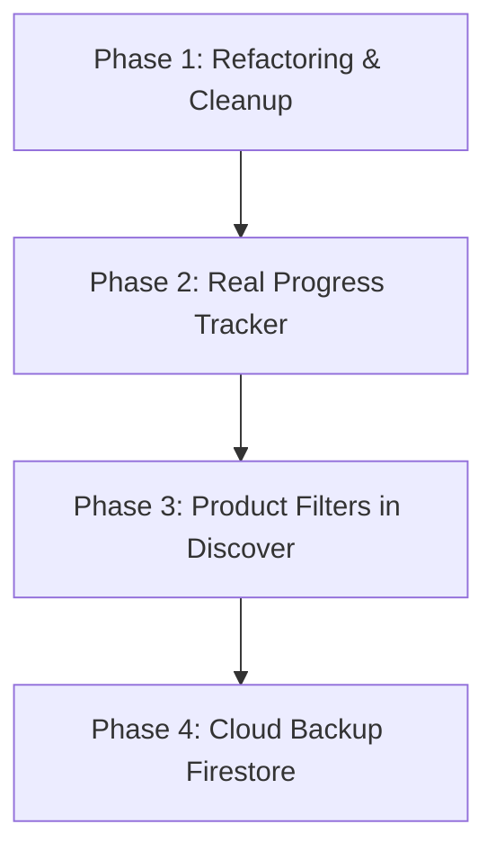

# Perencanaan & Saran Pengembangan Aplikasi Skinoura (Careskin+)

Dokumen ini berisi analisis arsitektur codebase, kualitas UI/UX, serta rekomendasi peta jalan (*roadmap*) pengembangan fitur baru untuk aplikasi **Skinoura**.

---

## 📌 Ringkasan Status Codebase Saat Ini

Aplikasi **Skinoura** (atau **Careskin+** pada bilah navigasi) dirancang sebagai asisten pribadi pelacak rutinitas perawatan kulit (*skincare tracker*) berbasis kecerdasan tipe kulit. 

### Komponen yang Sudah Ada:
1. **Autentikasi Ganda**: Mendukung alur masuk/daftar lokal menggunakan SQLite ([database_helper.dart](file:///D:/Project%20Flutter/Skinoura/skinoura/lib/database/database_helper.dart)) serta integrasi Firebase Auth ([firebase_auth_service.dart](file:///D:/Project%20Flutter/Skinoura/skinoura/lib/services/firebase_auth_service.dart)).
2. **Kuis Tipe Kulit (Skin Quiz)**: Menghitung skor tipe kulit secara dinamis (*Berminyak, Kering, Kombinasi, Sensitif*) dan menyimpannya di `SharedPreferences` ([form_quiz.dart](file:///D:/Project%20Flutter/Skinoura/skinoura/lib/views/form_quiz.dart)).
3. **Pencarian Kandungan (Discover)**: Menampilkan rekomendasi bahan aktif skincare berdasarkan kuis tipe kulit, dilengkapi formulir analisis comedogenicity, tingkat iritasi, dan evidence klinis ([Form_Discovery.dart](file:///D:/Project%20Flutter/Skinoura/skinoura/lib/views/Form_Discovery.dart)).
4. **Pelacak Rutinitas (Routine Tracker)**: Kalender geser horizontal 31 hari, pencatatan check/uncheck langkah skincare yang unik per hari (*temporal data*) menggunakan SharedPreferences, serta fitur hapus logis (*soft-delete*) agar riwayat kemarin tidak rusak ([Form_Ritual.dart](file:///D:/Project%20Flutter/Skinoura/skinoura/lib/views/Form_Ritual.dart)).
5. **Notifikasi Pengingat**: Integrasi alarm harian presisi maupun tidak presisi (*inexact fallback*) menggunakan [notification_service.dart](file:///D:/Project%20Flutter/Skinoura/skinoura/lib/services/notification_service.dart).

---

## 🛠️ Analisis Arsitektur & Utang Teknis (Technical Debt)

### 1. Sinkronisasi Data Lokal vs Cloud (SQLite vs Firebase)
*   **Masalah**: Rutinitas disimpan di SQLite lokal, sementara login didesain bisa menggunakan Firebase Auth. Jika pengguna mengganti perangkat, data rutinitasnya akan hilang karena tidak disinkronkan ke cloud.
*   **Solusi**: Migrasikan penyimpanan rutinitas dari SQLite lokal saja ke model sinkronisasi hibrida menggunakan **Cloud Firestore**. Firestore dapat bekerja secara offline (offline persistence) dan menyinkronkan data otomatis saat ada internet.

### 2. Inkonsistensi Alur Autentikasi
*   **Masalah**: Ada `UserModelSql` dan `UserModelFirebase`. Ini membuat kode autentikasi membingungkan dan rawan bug sinkronisasi sesi.
*   **Solusi**: Satukan alur autentikasi. Gunakan Firebase Auth sebagai satu-satunya sistem autentikasi, lalu simpan detail profil pengguna (nama, tipe kulit) di Firestore.

### 3. Peringatan Deprecations & Kode Inkomplit
*   **Peringatan Analisis**: Ada beberapa kode yang menggunakan `withOpacity` yang sekarang didepresiasi oleh Flutter SDK terbaru.
*   **Solusi**: Ganti penggunaan `color.withOpacity(value)` dengan `color.withValues(alpha: value)` untuk mencegah degradasi performa render warna.

---

## 🎨 Rekomendasi Desain UI/UX (Premium Aesthetics)

Desain Skinoura sudah memiliki pondasi warna hijau pastel (`#436155`) yang menenangkan. Berikut rekomendasi untuk mendongkrak visual agar terasa sangat premium:

### 1. Efek Glassmorphic & Animasi Mikro
*   Gunakan library **Lottie** (sudah terinstal di pubspec) untuk membuat animasi interaktif saat kuis selesai atau saat checklist rutin berhasil diselesaikan 100%.
*   Terapkan dekorasi `BackdropFilter` pada kartu info berlatar putih dengan sedikit blur untuk memberikan kesan kaca (*glassmorphism*) yang modern di atas latar belakang biru muda aplikasi.

### 2. Personalisasi Dashboard Utama
*   Indikator *Hydration, Barrier, Sensitivity, Sebum* pada [form_home.dart](file:///D:/Project%20Flutter/Skinoura/skinoura/lib/views/form_home.dart) saat ini masih berupa data statis (hardcoded).
*   **Saran**: Buat nilai-nilai ini berubah secara dinamis berdasarkan persentase kepatuhan rutinitas skincare pengguna selama 7 hari terakhir.

---

## 🚀 Peta Jalan Fitur Baru (New Features Roadmap)



### 📅 Fase 1: Pembersihan Utang Teknis & Deprecations (Segera)
*   Mengganti semua fungsi `withOpacity` dengan `.withValues()`.
*   Merapikan visual menu-menu kosong di profil.

### 📈 Fase 2: Implementasi Halaman Progress Riwayat (Priority: High)
Saat ini [form_progress.dart](file:///D:/Project%20Flutter/Skinoura/skinoura/lib/views/form_progress.dart) masih berupa `Placeholder`. Kita bisa membangun halaman ini dengan fitur:
*   **Completion Heatmap**: Kalender visual yang menunjukkan hari-hari di mana pengguna menyelesaikan rutinitasnya secara penuh (seperti kontribusi GitHub tapi versi skincare).
*   **Streak Tracker**: Menampilkan rantai hari beruntun (*streaks*) keaktifan pengguna menjaga kulitnya tetap sehat.
*   **Progress Photo Diary**: Memungkinkan pengguna mengambil foto wajah mereka setiap beberapa hari sekali, menyimpannya secara lokal/cloud, dan membandingkannya secara berdampingan (*before-after slider*) untuk melihat perbaikan kulit nyata dari waktu ke waktu.

### 🔍 Fase 3: Pencarian Berdasarkan Kategori Produk (Discover)
Di dalam [Form_Discovery.dart](file:///D:/Project%20Flutter/Skinoura/skinoura/lib/views/Form_Discovery.dart), ada kode produk yang di-comment out.
*   **Saran**: Aktifkan kembali daftar produk kosmetik. Tambahkan filter kategori (contoh: *Face Wash, Toner, Serum, Sunscreen*) agar pengguna tidak hanya tahu kandungan aktif kimia, tetapi juga tahu produk nyata di pasar yang aman untuk kulit mereka.

### ☁️ Fase 4: Cloud Sync & Backup (Firestore)
*   Membuat *background sync worker* yang otomatis mem-backup data checklist harian dari `SharedPreferences` dan data `rituals` dari SQLite lokal ke Firebase Cloud Firestore setiap kali ada perubahan data secara realtime.

---

## 📝 Langkah Eksekusi Kode Pengembang

Untuk mempermudah pembersihan warning deprecated warna, Anda dapat mengubah:
```dart
// Sebelum (Deprecated)
Colors.black.withOpacity(0.02)

// Sesudah (Rekomendasi SDK)
Colors.black.withValues(alpha: 0.02)
```
Hal ini akan membersihkan 10+ warning pada laporan `flutter analyze` aplikasi Anda.
