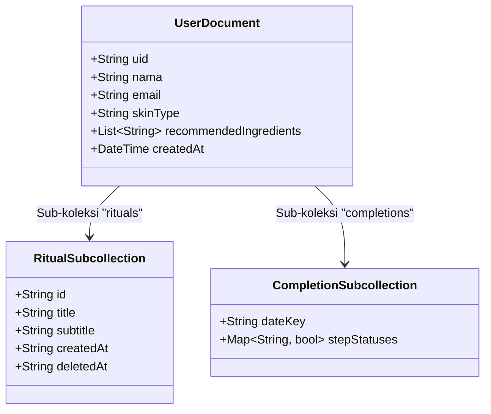

# Perencanaan Migrasi Data ke Firebase (Skinoura)

Dokumen ini berisi analisis detail mengenai data lokal (SQLite & SharedPreferences) di aplikasi **Skinoura** dan bagaimana merencanakan migrasinya ke **Firebase Cloud Firestore** agar tersimpan aman di cloud, mendukung sinkronisasi multi-device, dan mencegah data hilang saat aplikasi diinstal ulang.

---

## 📊 Pemetaan Data: Lokal vs Firebase

Saat ini, data pengguna terbagi di beberapa tempat penyimpanan lokal. Berikut rencana pemetaan migrasinya ke Firebase:

| Data/Fitur | Penyimpanan Saat Ini | Rencana Migrasi Firebase | Alasan & Keuntungan |
| :--- | :--- | :--- | :--- |
| **Profil Pengguna** | `SharedPreferences` (`nama`, `email`) | Dokumen `users/{userId}` di Firestore | Mengamankan data profil terpusat, memudahkan pembaruan data pengguna secara cloud. |
| **Kuis Tipe Kulit** | `SharedPreferences` (`skinType`, `recommendedIngredients`) | Kolom tambahan di dokumen `users/{userId}` | Mengintegrasikan preferensi kulit pengguna ke profil inti mereka di cloud. |
| **Daftar Langkah Rutinitas** | SQLite Tabel `rituals` | Sub-koleksi `users/{userId}/rituals/{ritualId}` | Sinkronisasi otomatis daftar skincare antar perangkat secara real-time. |
| **Status Checklist Harian** | `SharedPreferences` (`{dateKey}_{ritualId}`) | Sub-koleksi `users/{userId}/completions/{dateKey}` | Pencatatan riwayat kepatuhan skincare yang aman di cloud, siap diolah untuk statistik/grafik progress. |
| **Kamus Kandungan & Produk** | File Dart statis (`list_ingredient.dart`, dsb) | Koleksi global `ingredients` & `products` | Memungkinkan pembaruan data produk/kandungan baru langsung dari Firebase Console tanpa update aplikasi di Google Play Store. |

---

## 📐 Arsitektur Skema Database Firestore

Berikut adalah visualisasi struktur koleksi dokumen yang direkomendasikan pada Cloud Firestore:



### Detail Skema Dokumen Firestore

#### 1. Dokumen Profil Pengguna (`/users/{userId}`)
```json
{
  "uid": "U123456789",
  "nama": "Jane Doe",
  "email": "janedoe@email.com",
  "skinType": "Sensitif",
  "recommendedIngredients": ["Centella Asiatica", "Ceramide", "Hyaluronic Acid"],
  "createdAt": "2026-07-07T03:00:00Z"
}
```

#### 2. Sub-koleksi Rutinitas Skincare (`/users/{userId}/rituals/{ritualId}`)
```json
{
  "id": "R98765",
  "title": "Hydrating Toner",
  "subtitle": "Hyaluronic Acid 2%",
  "createdAt": "2026-07-07",
  "deletedAt": null
}
```

#### 3. Sub-koleksi Checklist Harian (`/users/{userId}/completions/{dateKey}`)
Dokumen ini dibuat per hari (misal ID dokumennya: `2026-07-07`):
```json
{
  "dateKey": "2026-07-07",
  "stepStatuses": {
    "R98765": true,
    "R54321": false
  }
}
```

---

## 🗺️ Tahapan Langkah Migrasi (Implementation Roadmap)

### 🚀 Tahap 1: Pembaruan Model Data (`UserModelFirebase`)
*   Tambahkan field `skinType` and `recommendedIngredients` ke dalam [user_model_firebase.dart](file:///D:/Project%20Flutter/Skinoura/skinoura/lib/models/user_model_firebase.dart).
*   Sesuaikan metode `fromMap` dan `toMap` agar dapat membaca/menulis data kuis dari/ke Firestore.

### 📝 Tahap 2: Integrasi Hasil Kuis (`form_quiz.dart`)
*   Saat kuis selesai di `_hitungHasilQuiz()`, selain menyimpannya ke SharedPreferences lokal untuk kemudahan cache, kirimkan juga hasilnya ke Firestore:
    ```dart
    final String uid = FirebaseAuthService().currentFirebaseUser!.uid;
    await FirebaseFirestore.instance.collection('users').doc(uid).update({
      'skinType': tipeKulitFinal,
      'recommendedIngredients': listIngredients,
    });
    ```

### 🗓️ Tahap 3: Pembuatan Firebase Helper Rutinitas (`firebase_db_helper.dart`)
*   Buat fungsi CRUD rutinitas berbasis Firestore di [firebase_db_helper.dart](file:///D:/Project%20Flutter/Skinoura/skinoura/lib/database/firebase_db_helper.dart):
    *   `insertRitualCloud(RitualModel ritual)` -> Menambah ke Firestore sub-koleksi `rituals`.
    *   `getRitualsCloud()` -> Mengunduh data sub-koleksi `rituals`.
    *   `softDeleteRitualCloud(String ritualId, String date)` -> Mengisi `deletedAt` di Firestore.
    *   `saveDailyCompletionCloud(String date, String ritualId, bool status)` -> Menyimpan status checklist harian ke dokumen Firestore `completions/{date}`.

### 🔄 Tahap 4: Sinkronisasi Offline-to-Online (Hibrida)
*   Aktifkan fitur offline persistence di Firestore (biasanya aktif secara default di Flutter) agar aplikasi tetap berjalan responsif meskipun pengguna tidak memiliki koneksi internet.
*   Ubah pemanggilan di [Form_Ritual.dart](file:///D:/Project%20Flutter/Skinoura/skinoura/lib/views/Form_Ritual.dart) dari `DBHelper` (lokal) ke `FirebaseDBHelper` (cloud).
